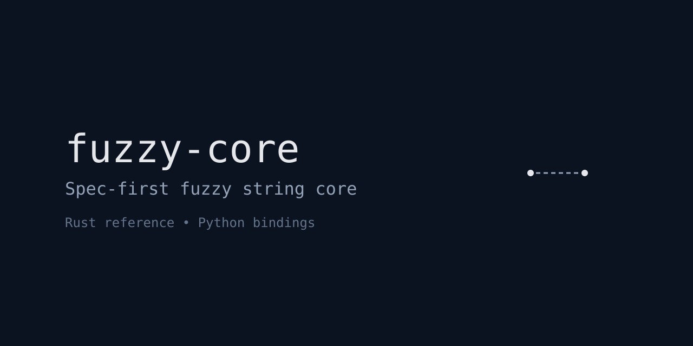

<p align="left">
  
</p>

<p align="center">
  
  
  
  
  
</p>

# fuzzy-core

**A spec-first fuzzy string similarity core**, implemented in **Rust** with a **Python binding**.

`fuzzy-core` provides a small, deterministic, and explainable fuzzy matching primitive,
designed to be used as a **building block** for higher-level domain fuzzy systems.

## Philosophy

`fuzzy-core` is intentionally **small and opinionated**.

- ❌ Not a full fuzzy search engine
- ❌ Not domain-aware
- ❌ Not semantic or embedding-based

Instead, it focuses on:

- ✅ deterministic behavior
- ✅ explainable similarity score
- ✅ stable core primitive
- ✅ language-agnostic design (via bindings)

This project is designed to be composed into **domain-specific fuzzy systems**.

## What it does

Given two strings, `fuzzy-core`:

1. Normalizes the input (case, whitespace, punctuation)
2. Computes Levenshtein edit distance
3. Converts the distance into a normalized similarity score in range `[0.0, 1.0]`

## Usage (Rust)

Add the crate to your project (once published):

```rust
use fuzzy_core::similarity;

fn main() {
    let score = similarity("Hello, World!", "hello world");
    println!("{}", score); // ~1.0
}
```

The public API is intentionally minimal:

```rust
pub fn similarity(a: &str, b: &str) -> f64
```

## Usage (Python)

Install locally (development):

```bash
maturin develop
```

Then in Python:

```python
import fuzzy_core
print(fuzzy_core.similarity("Hello, World!", "hello world"))
print(fuzzy_core.similarity("ab", "ac"))  # ~0.5
```

## Similarity Score Semantics

- `1.0` → strings are identical after normalization
- `0.0` → strings are completely dissimilar
- values in between indicate relative similarity

The score is **relative to string length**, not absolute distance.

## Non-Goals

This project intentionally does NOT include:

- token-based matching
- phonetic matching
- language-specific rules
- embeddings or ML models
- thresholding or decision logic

Those belong in higher-level systems built on top of `fuzzy-core`.

## Project Structure

```text
reference/rust/
├── src/
│   ├── lib.rs          # public API
│   ├── normalize.rs    # normalization logic
│   ├── levenshtein.rs  # distance algorithm
│   ├── score.rs        # score normalization
│   └── python.rs       # PyO3 binding
├── pyproject.toml
├── Cargo.toml
└── python/tests/       # pytest
```

## Status

Current status: **v0.1.x (early but stable core)**

Planned next steps:

- CI (Rust + Python)
- language bindings (Node.js / WASM)
- domain-fuzzy layer (dataset-aware matching)

## License

MIT
